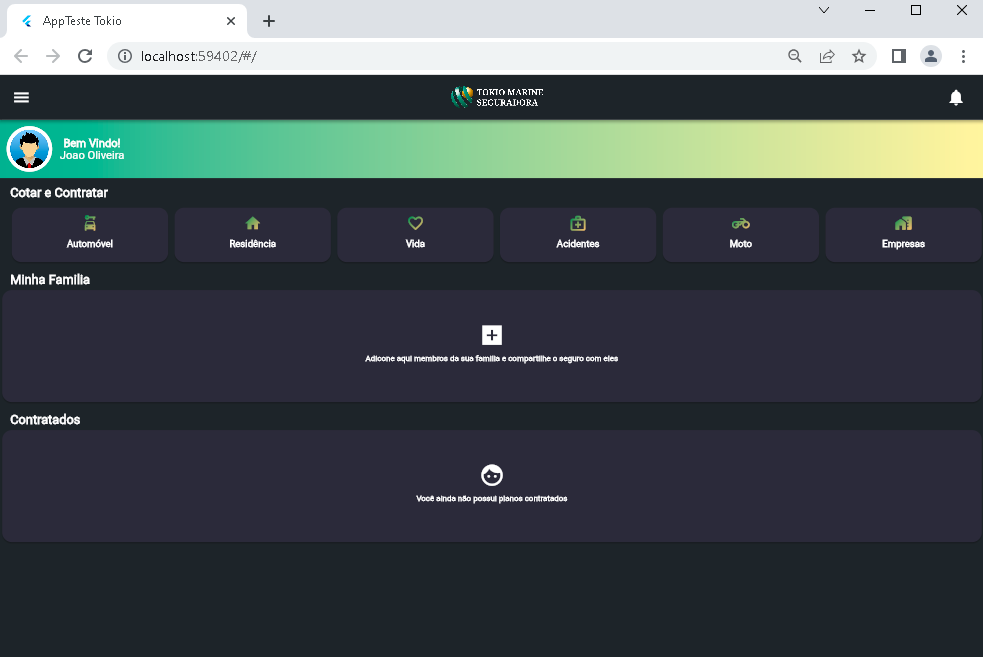
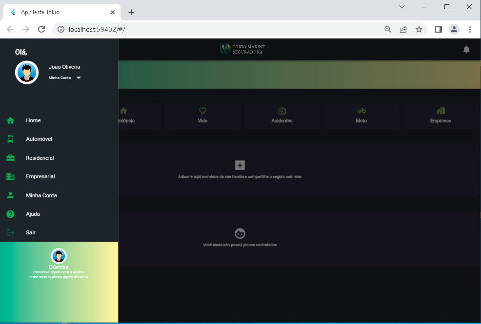
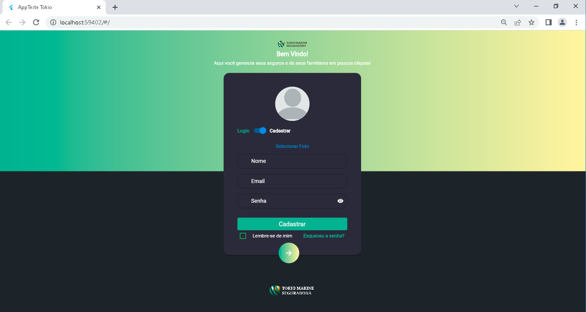
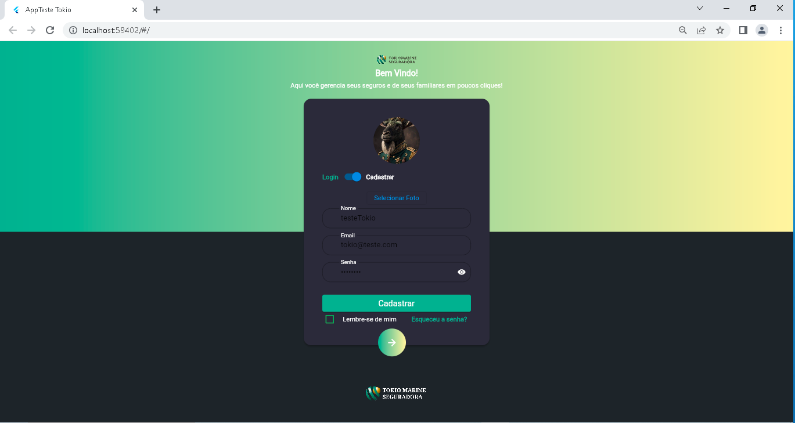
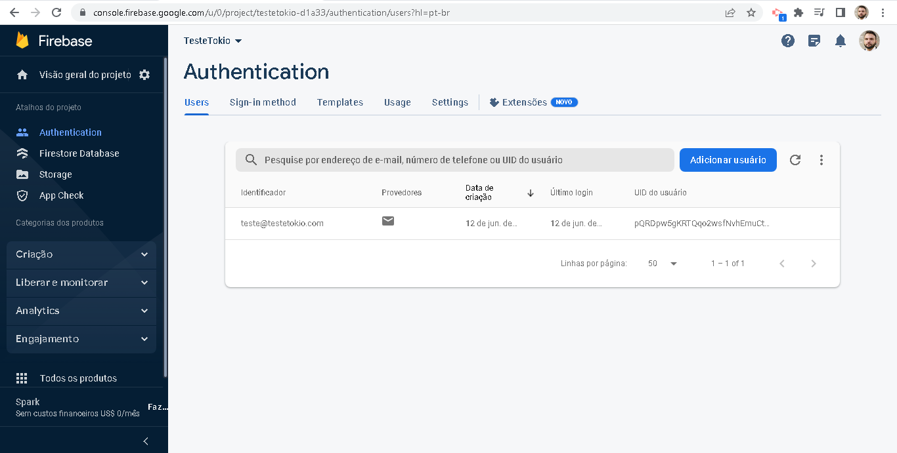
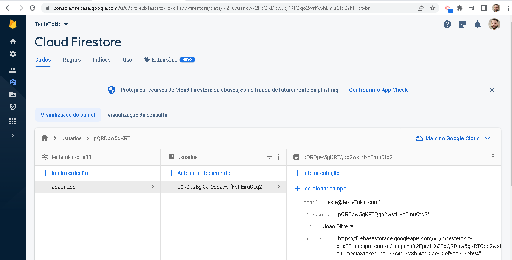
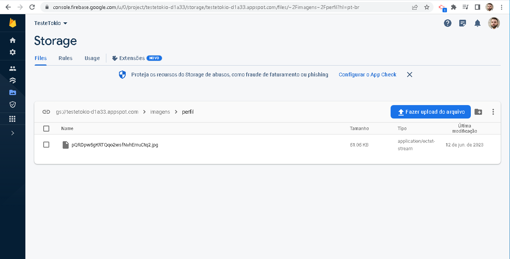

# Teste Técnico - Tokio Marine

<p align="center">
  
</p>

Este é um projeto Flutter desenvolvido como parte de um teste técnico para a Tokio Marine. O objetivo do teste é criar a tela de login e navegar para a tela inicial (Home), utilizando o Firebase para autenticação e registro.

## 🚀 Características

- **Tela de Login:** A aplicação apresenta uma tela de login, onde os usuários podem inserir suas informações de autenticação. O Firebase é utilizado para validar as credenciais fornecidas e permitir o acesso à tela inicial.

- **Tela de Cadastro:** Além da tela de login, a aplicação também possui uma tela de cadastro. Nessa tela, os usuários podem inserir seu nome e adicionar uma foto de perfil. O Firebase é responsável por armazenar e gerenciar essas informações do usuário.

- **Uso de Switch e Visibility:** A aplicação utiliza os componentes Switch e Visibility para alternar entre a tela de login e a tela de cadastro. Isso proporciona uma experiência intuitiva para o usuário, permitindo que ele escolha entre criar uma nova conta ou fazer login em uma existente.

- **WebView:** Ao clicar no card "Auto", a aplicação verifica se está sendo executada no aplicativo Flutter ou no navegador web. Se estiver no aplicativo, é aberta uma WebView dentro do próprio aplicativo. Se estiver no navegador web, é aberta uma nova guia para exibir o conteúdo.

- **Versão Web e APP:** A aplicação foi desenvolvida de forma a ter uma versão para web e uma versão para aplicativo móvel, utilizando o mesmo código-fonte. Isso permite que os usuários acessem a aplicação tanto pelo navegador web quanto pelo aplicativo Flutter, proporcionando uma experiência consistente.

## 📱 Screenshots

<p align="center">
  
  
  
  
  
  
  
  
  
</p>

## ⚙️ Como Executar o Projeto

Para executar o projeto, siga as instruções abaixo:

1. Certifique-se de ter o Flutter instalado em sua máquina. Caso ainda não tenha, siga as instruções no site oficial do Flutter para instalá-lo.

2. Clone este repositório em sua máquina.

   ```
   git clone <url_do_repositório>
   ```

3. Acesse o diretório do projeto.

   ```
   cd nome_do_projeto
   ```

4. Execute o comando abaixo para baixar as dependências do projeto.

   ```
   flutter pub get
   ```

5. Conecte seu dispositivo móvel ou inicie um emulador.

6. Execute o comando abaixo para iniciar o aplicativo.

   ```
   flutter run
   ```

   Certifique-se de que seu dispositivo esteja conectado corretamente e o modo de depuração esteja ativado.

Agora você está pronto para explorar o projeto e testar as funcionalidades da tela de login, cadastro e navegação para a tela inicial. Divirta-se!

## 📝 Licença

Este projeto está licenciado sob a [Licença MIT](LICENSE).

---

Feito com ❤ 

